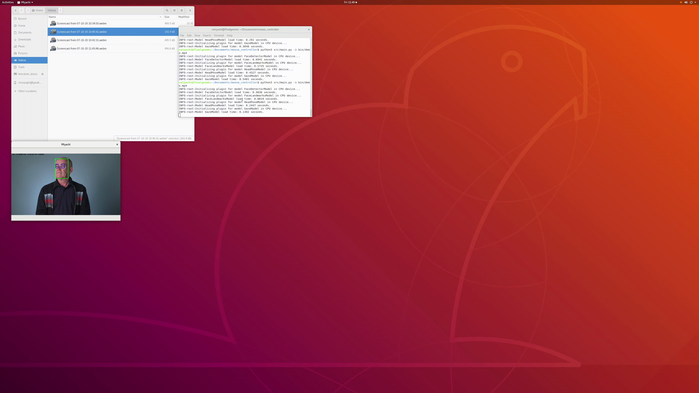
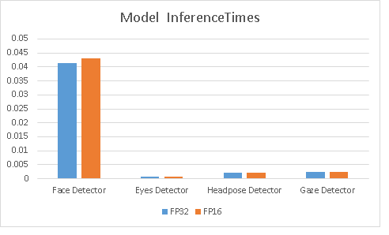

# Computer Pointer Controller

This is the final project for the Udacity Edge AI for IoT

This project uses a number of models that work together in the following way. 

<p align="center">

</p>

Here is an image of the ouptput.  It is hard to see but I drew boxes around the face detected, around each eye, and then a red arrow for the direction of the gaze. Notice that the mouse does move with the gaze but it is easier to see with the arrows. 


## Project Set Up and Installation

### Step 1. Install OpenVINO
Intall OpenVINO, follow instructions [here](https://docs.openvinotoolkit.org/latest/index.html).  This project was run and tested on Ubuntu 18.04 and OpenVINO version 2020.1.

### Step 2. Download this Repository
This includes the pretrained models. Here is the structure:

```
├── bin
│   └── demo.mp4
├── intel
│   ├── face-detection-adas-0001
│   │   ├── FP16
│   │   │   ├── face-detection-adas-0001.bin
│   │   │   └── face-detection-adas-0001.xml
│   │   └── FP32
│   │       ├── face-detection-adas-0001.bin
│   │       └── face-detection-adas-0001.xml
│   ├── gaze-estimation-adas-0002
│   │   ├── FP16
│   │   │   ├── gaze-estimation-adas-0002.bin
│   │   │   └── gaze-estimation-adas-0002.xml
│   │   └── FP32
│   │       ├── gaze-estimation-adas-0002.bin
│   │       └── gaze-estimation-adas-0002.xml
│   ├── head-pose-estimation-adas-0001
│   │   ├── FP16
│   │   │   ├── head-pose-estimation-adas-0001.bin
│   │   │   └── head-pose-estimation-adas-0001.xml
│   │   └── FP32
│   │       ├── head-pose-estimation-adas-0001.bin
│   │       └── head-pose-estimation-adas-0001.xml
│   └── landmarks-regression-retail-0009
│       ├── FP16
│       │   ├── landmarks-regression-retail-0009.bin
│       │   └── landmarks-regression-retail-0009.xml
│       └── FP32
│           ├── landmarks-regression-retail-0009.bin
│           └── landmarks-regression-retail-0009.xml
├── README.md
├── requirements.txt
├── resources
│   ├── FP16.png
│   ├── FP32.png
│   └── pipeline.png
├── src
│   ├── input_feeder.py
│   ├── main.py
│   ├── model.py
│   ├── mouse_controller.py
└── utils.py
```


### Step 3. Create a Python Virtual Environment
This project uses python3.

```
python3 -m venv <your-env>
```

Then run this and install required libraries.

```
source your-env/bin/activate
```

```
 pip3 install -r requirements.txt
```

### Step 4. Understand the models used
The models used for this project are the following:

[Face Detection](https://docs.openvinotoolkit.org/latest/_models_intel_head_pose_estimation_adas_0001_description_head_pose_estimation_adas_0001.html)

[Head Pose Estimation](https://docs.openvinotoolkit.org/latest/_models_intel_gaze_estimation_adas_0002_description_gaze_estimation_adas_0002.html)

[Facial Landmarks Detection](https://docs.openvinotoolkit.org/latest/_models_intel_gaze_estimation_adas_0002_description_gaze_estimation_adas_0002.html)

[Gaze Estimation](https://docs.openvinotoolkit.org/latest/_models_intel_gaze_estimation_adas_0002_description_gaze_estimation_adas_0002.html)


## Demo

I hard-coded the model inputs with defaults but you can use flags to install your own models. The only required input is the -i flag for input. 
```
python3 src/main.py -i bin/demo.mp4
```

Or using a webcamera:
```
python src/main.py -i CAM
```

## Documentation

### Models Flags:

To use different models than the default ones, you could use the following flags. However, keep in mind that model output shape could change, potentially crashing the application.

```-mf or --model_facedetector```: To indicate the path to the face detector model .xml file.

```-ml or --model_facelm```: To indicate the path to the face landmarks detector model .xml file.

```-mh or --model_headpose```: To indicate the path to the headpose model .xml file.

```-mg or --model_gaze```: To indicate the path to the gaze detector model .xml file

### Other Flags:

These flags control other behaviours of the code logic: 

```-l or --cpu_extension```: If needed, this flag should be used to provide the path for an OpenVINO cpu extension.

```-d or --device```: To specify the hardware where the models will be running. Default is CPU.

```-pt or --prob_threshold```: To state the confidence the models need to have in order to consider an actual detection.


## Benchmarks

**Processor Characteristics:** Azure Ubuntu 18.04 Standard D2s v3 (2 vcpus, 8 GiB memory)
**Note**: The mouse didn't move on my Ubuntu server and this is a known problem with 18.04.  It flickered and changed shaped but didn't follow the eye movement.  Thus I drew in boxes and arrows in the code. 


#### Average inference time based on precision:

<p align="center">

</p>


#### Models inference time (in secs):


|  Model /Size      |   Face Detector    |  Eyes Detector  | Headpose Detector  | Gaze Detector  |
|:-----------------:|:------------------:|:---------------:|-------------------:|---------------:|
| FP32              |  0.0413            | 0.00075         |  0.00219           | 0.00229        |
| FP16              |  0.0431            | 0.00077         |  0.00213           | 0.0024         |


## Final Comments

I did not graph the load times as with model precisions tested had close to the same load times. As the graph shows, face detection is the most expensive for inference computation. 

Note that the inference times didn't vary much between the two precisions, with FP16 being slightly faster.  Accuracy appears to be identical between the two models (arrows produced by gaze direction). 
